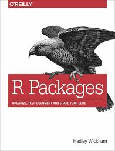

```{r, include = FALSE}
knitr::opts_chunk$set(
  collapse = TRUE,
  comment = "#>"
)
```

```{r include=FALSE}
colorize <- function(x, color) {
  if (knitr::is_latex_output()) {
    sprintf("\\textcolor{%s}{%s}", color, x)
  } else if (knitr::is_html_output()) {
    sprintf("<span style='color: %s;'>%s</span>", color,
      x)
  } else x
}
```

# `r colorize("How to create an R package","green")`
<br>

<object data="Articles/CmocrearpaquetesenR.pdf" width=775, height=550></object>

<br>

# `r colorize("Link and Image","green")`

## `r colorize("Link","blue")`

https://oscarperpinan.github.io/R/Paquetes.pdf

## `r colorize("Image","blue")`

<center>{width=300 height=450}</center>
